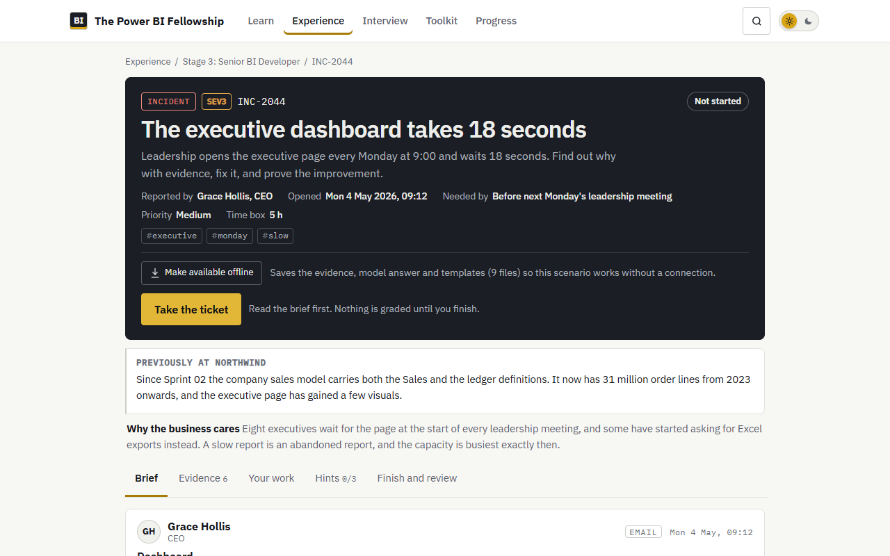
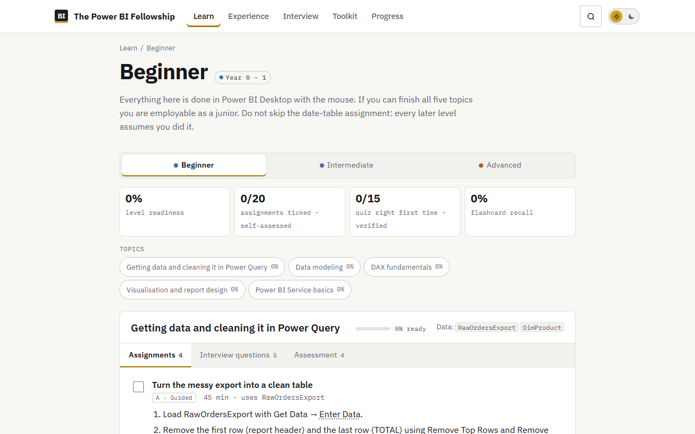
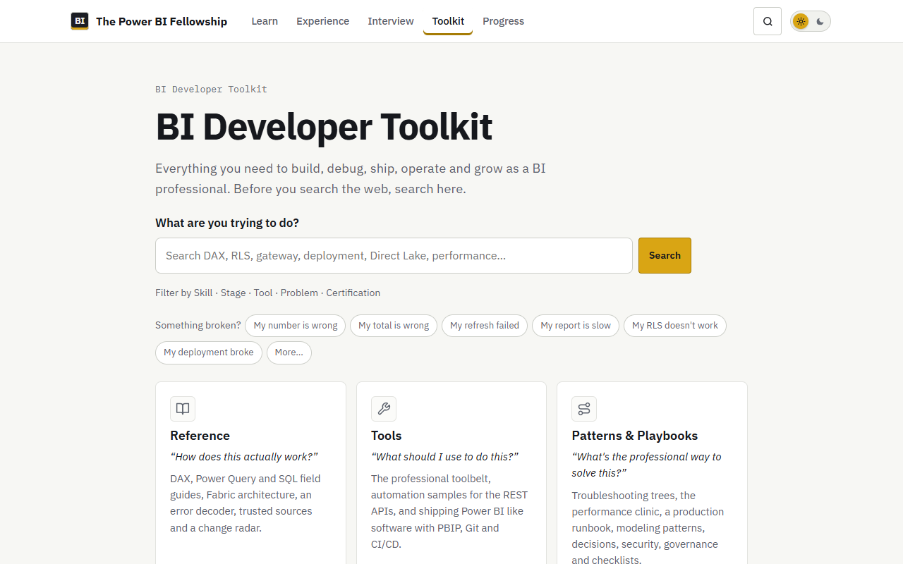
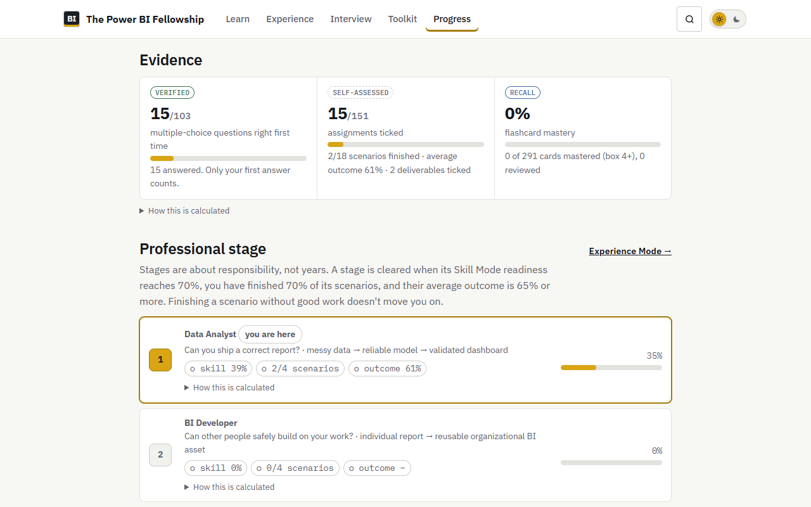

<p align="center"></p>

<h1 align="center">The Power BI Fellowship</h1>

<p align="center"><b>Learn Power BI by doing the work.</b><br>A free, open-source fellowship: hands-on skills, then the tickets, incidents and decisions BI developers usually meet only after years on the job.</p>

<p align="center"><a href="https://sudhanshumukherjeexx.github.io/power-bi/"><b>Open the site →</b></a></p>

<p align="center">
<a href="https://github.com/sudhanshumukherjeexx/power-bi/actions/workflows/validate.yml"></a>
<a href="https://sudhanshumukherjeexx.github.io/power-bi/"></a>
<a href="https://github.com/sudhanshumukherjeexx/power-bi/releases"></a>
<a href="LICENSE"></a>
</p>

<p align="center"></p>

## What is this?

Most Power BI courses teach features. This one teaches the job. First you learn each capability with exercises whose answers are checked against real (synthetic) data. Then you join the BI team at **Northwind Outdoors**, a fictional retailer, and handle what actually lands on a BI developer's desk: vague requests, disputed numbers, a security incident, a refresh that failed at 06:17, a merge conflict, an architecture decision. Nobody tells you which feature to use. You get the evidence and you decide.

No account, no server, no tracking by default. Your progress stays in your browser.

## Learn the work, not just the tool

```
LEARN      Skill Mode       three levels, seven tracks, checkable answers
  ↓
PRACTICE   Experience Mode  18 tickets, incidents and decisions at Northwind
  ↓
DEBUG      Toolkit          troubleshooting trees, performance clinic, error decoder
  ↓
SHIP       PBIP, Git, CI/CD, deployment pipelines
  ↓
OPERATE    refresh failures, RLS, governance, postmortems
  ↓
ARCHITECT  Fabric, ADRs, architecture review
```

### Skill Mode: how does this capability work?



Three levels (Beginner, Intermediate, Advanced) and seven tracks (SQL for BI, warehousing, testing, automation and APIs, governance, Fabric, modern Power BI). Each assignment has an expected result you can check and a worked solution you open once you've tried. Guidance shrinks as you go, from guided steps (A) to an ambiguous decision you have to justify (D).

### Experience Mode: can you recognise when it's needed, under real conditions?

Ten connected sprints and eight drills. Each has emails, chat messages, evidence files, progressive hints, a professional rubric, and a model answer that opens only when you ask. Labels read the way a reporter writes them (`#executive #monday #slow`), never naming the cause. Your decisions are recorded, and later scenarios refer back to them. Any scenario can be **made available offline**.

| | Scenario |
|---|---|
| 01 | An executive dashboard from a vague request and a messy export |
| 02 | Finance says your revenue is too high: reconcile it to the ledger |
| 03 | A manager can see other regions' payroll |
| 04 | The executive page takes 18 seconds |
| 05 | Three models, three "Revenue" measures |
| 06 | Two developers changed the same measure |
| 07 | Test is right, Production is wrong |
| 08 | The board pack refresh failed at 06:17 |
| 09 | Should Northwind move to Fabric, and how? |
| 10 | Dozens of reports, no owner: an architecture review |

### BI Developer Toolkit: for when you're on the job



One search ("What are you trying to do?") across 30 guides: "What's broken?" decision trees, DAX, Power Query and SQL field guides, a performance clinic, a production runbook, an error decoder, security and governance, checklists, automation samples, career and certification. The **Library** holds the glossary, cheat sheets, 26 professional templates, a curated catalog of 118 external resources, the datasets and a starter PBIP project.

### Progress you can trust



Every number says what it rests on: **verified** (your first quiz answer), **self-assessed** (what you ticked and how you rated your work) or **recall** (spaced repetition), with "How this is calculated" under each. A stage (Data Analyst → BI Developer → Senior → BI Engineer → Architect) is cleared by finished, well-rated scenarios, not by ticking boxes. Hints are recorded as independence and never lower your outcome. Certification preparation is weighted by Microsoft's published domain weights and doesn't pretend to predict an exam.

## What you need

[Power BI Desktop](https://www.microsoft.com/power-platform/products/power-bi/desktop) (free) covers most of the site. Some topics also use a free Power BI account, [DAX Studio](https://daxstudio.org), [Tabular Editor 2](https://github.com/TabularEditor/TabularEditor), any SQL engine (SQL Server Express, DuckDB or SQLite) and a Fabric trial. Where a feature needs paid capacity, the exercise says so and offers another way to practise.

## Tested, not trusted

- **Data:** every dataset is generated from a fixed seed, and its counts, nulls, duplicates, keys and planted defects are asserted. Every number in an expected result is computed from that data at build time.
- **SQL:** every example declares where it runs, and every one parses in its dialect. Answers are executed on SQLite, and on SQL Server 2022, where both engines must return the same rows ([how](docs/sql-validation.md)).
- **No answer leaks:** pages are readable without JavaScript, and a test fails the build if a hint, rubric or model answer appears in them.
- **In a real browser:** the critical journeys, accessibility (axe-core, both themes) and layout at four widths are tested on every push. Nothing deploys unless everything passes.
- **Current:** fast-moving content carries a verification date, and an issue opens automatically when its review is due.

## Contribute

The website is in `site/`, its source in `content/`, the build in `tools/`, the tests in `tests/`. `npm ci && npm run check` builds and tests everything, and `npm run serve` previews it. See [CONTRIBUTING.md](CONTRIBUTING.md) to add a topic, a scenario, a guide or a fix, and [CHANGELOG.md](CHANGELOG.md) for what changed. Privacy: [PRIVACY.md](PRIVACY.md). Security reports: [SECURITY.md](SECURITY.md).

## Disclaimer

No website can replace years of employment. This one puts you in front of the situations that usually take years to meet, deliberately and with feedback, so you recognise them when they happen for real.

Northwind Outdoors and everyone in it are fictional, and all data is synthetic. Power BI, Microsoft Fabric and related names are trademarks of Microsoft. This project isn't affiliated with Microsoft. [MIT License](LICENSE).
